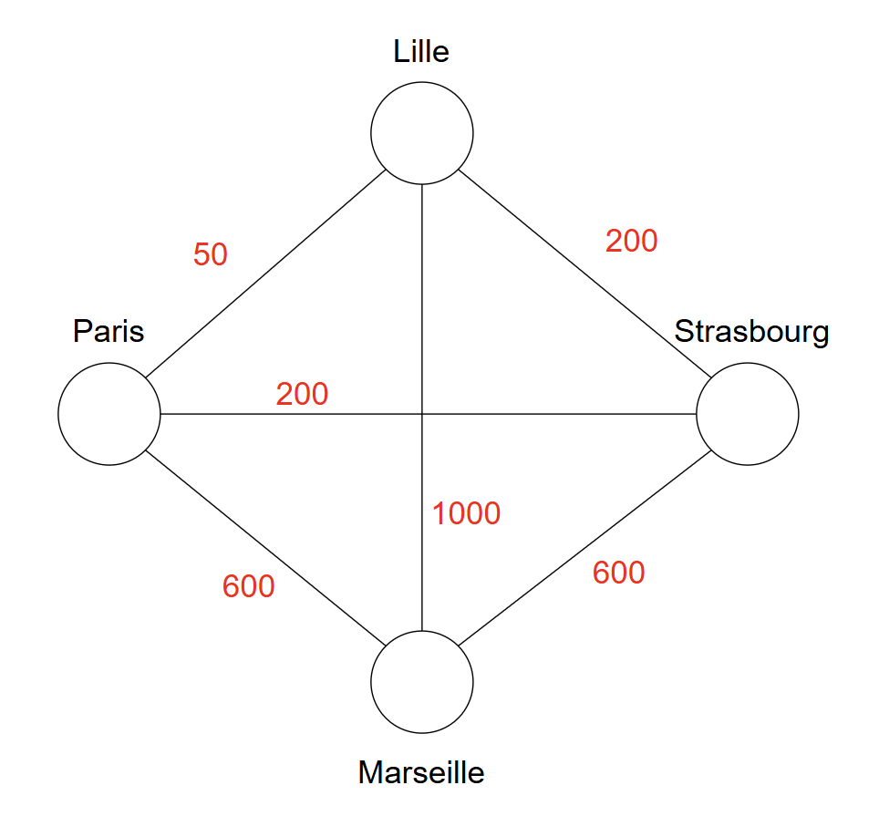
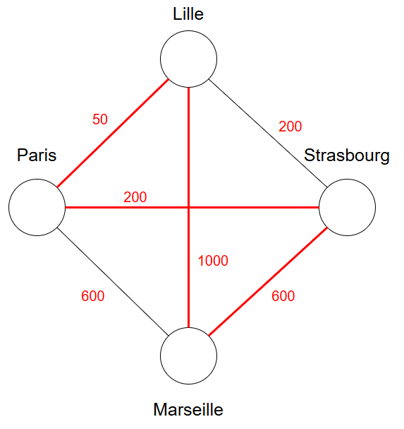
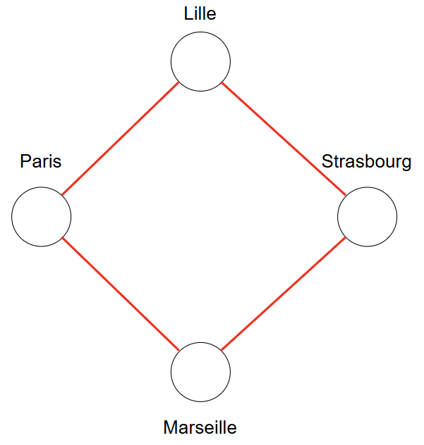
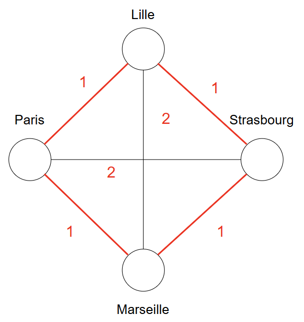

# Advanced Algorithms Project - Group 2

KANIAN Nicolas -
MASSON Louison - 
CANPOLAT Guluzar - 
NABADJA Richard

- [Advanced Algorithms Project - Group 2](#advanced-algorithms-project---group-2)
  - [Introduction 🚚](#introduction-)
  - [Data and Variables](#data-and-variables)
  - [Constraints](#constraints)
    - [1. All customers are visited exactly once](#1-all-customers-are-visited-exactly-once)
    - [2. Trucks leave a node as often as they enter](#2-trucks-leave-a-node-as-often-as-they-enter)
    - [3. Truck capacity constraint](#3-truck-capacity-constraint)
    - [4. All trucks leave the warehouse](#4-all-trucks-leave-the-warehouse)
    - [5. Deliveries must be made during the delivery time window](#5-deliveries-must-be-made-during-the-delivery-time-window)
    - [6. Fitness function (Objective)](#6-fitness-function-objective)
- [Computational Complexity of VRPTW](#computational-complexity-of-vrptw)
  - [VRPTW is in NP](#vrptw-is-in-np)
    - [What is a certificate?](#what-is-a-certificate)
    - [Verification Process](#verification-process)
  - [VRPTW is NP-Complete](#vrptw-is-np-complete)
    - [**TSP is NP-Complete**](#tsp-is-np-complete)
        - [*Example of Cities graph*](#example-of-cities-graph)
      - [Optimization Problem](#optimization-problem)
      - [Decisional Problem](#decisional-problem)
      - [Demonstration that TSP problem is NP](#demonstration-that-tsp-problem-is-np)
      - [Demonstration that the TSP Problem is NP-Hard](#demonstration-that-the-tsp-problem-is-np-hard)
    - [Mapping TSP to VRPTW](#mapping-tsp-to-vrptw)
      - [Quick Comparison Table](#quick-comparison-table)
    - [Conclusion](#conclusion)
- [Best Approach to Solve VRPTW](#best-approach-to-solve-vrptw)
  - [Algorithmic Design](#algorithmic-design)
    - [1. Exact Algorithms](#1-exact-algorithms)
    - [2. Heuristic Methods](#2-heuristic-methods)
    - [3. Metaheuristic Algorithms](#3-metaheuristic-algorithms)
    - [4. Hybrid Approaches](#4-hybrid-approaches)
    - [Choosing by Instance Size](#choosing-by-instance-size)
- [Experimental Approach](#experimental-approach)
    - [Initial Idea — Ant Colony Optimization (ACO)](#initial-idea--ant-colony-optimization-aco)
  - [Final Approach — Clarke \& Wright + Tabu Search + VNS](#final-approach--clarke--wright--tabu-search--vns)
    - [🔹 1 Clarke \& Wright Savings Algorithm](#-1-clarke--wright-savings-algorithm)
    - [🔹 2 Tabu Search (TS)](#-2-tabu-search-ts)
    - [🔹 3 Variable Neighborhood Search (VNS)](#-3-variable-neighborhood-search-vns)
    - [🔹 4 Summary of the Final Strategy](#-4-summary-of-the-final-strategy)
    - [🔹 5 Key Advantages of Our Final Approach](#-5-key-advantages-of-our-final-approach)

## Introduction 🚚
In the Vehicle Routing Problem with Time Windows (VRPTW), a set number of customers have to be delivered to by a set amount of delivery trucks.

The VRPTW is and extension of the Traveling Salesman Problem (TSP) with multiple entities (trucks) making deliveries at the same time instead of only one salesman. Furthermore, additional restrictions such as delivery time windows or truck capacity are often imposed.

In our project we choose these restrictions:

- Vehicle Capacity Constraints: Each vehicle has a maximum capacity, and the sum of the demands of the customers served on the same route must not exceed this capacity.
- Service Time Windows: Each customer has a specific time window during which they must be served. This imposes a restriction on the vehicle’s arrival: it must arrive at the customer within this time frame. If it arrives before the window opens, it must wait; if it arrives after, the route is invalid.
- Return to Warehouse Constraint: Each route must start and end at the central warehouse, and each vehicle must complete a single trip starting from the warehouse and return once its route is finished.
- Single Visit per Customer: Each customer must be visited exactly once by a vehicle (within the framework of the classic VRPTW).

To simplify, we consider that the travel time from (*i*) to (*j*) equals the distance between (*i*) and (*j*).

The objective is to minimize the number of routes and the total time/distance traveled by the trucks.

## Data and Variables

- V: Set of nodes in the graph (customers + warehouse)
- E: Set of edges in the graph (routes between nodes); we consider a complete graph
- w(*i*, *j*): Cost associated with each edge (distance between node *i* and node *j*)
- o(*i*): Opening time of the time window for customer *i*
- e(*i*): Closing time of the time window for customer *i*
- D(*i*): Demand of customer *i* (number of parcels to deliver)
- s(*i*): Service duration at customer *i* (time spent delivering parcels on site)
- p: Number of available vehicles
- Qk: Maximum capacity of vehicle k
- tik: Arrival time at customer *i* by vehicle k

## Constraints

### 1. All customers are visited exactly once

Each customer must be served exactly once by the fleet of vehicles. No customer is skipped or visited multiple times.

$$
\sum_{i=1}^{n} \sum_{k=1}^{p} x_{ijk} = 1 \quad \forall j \in \{2, \ldots, n\}
$$

---

### 2. Trucks leave a node as often as they enter

For each vehicle and each customer, the number of times the vehicle arrives at the customer equals the number of times it leaves, preventing vehicles from getting stuck.

$$
\sum_{i=1}^{n} x_{ijk} = \sum_{l=1}^{n} x_{jlk} \quad \forall j \in \{2, \ldots, n\}, \forall k \in \{1, \ldots, p\}
$$

---

### 3. Truck capacity constraint

The total demand of customers served by a vehicle must not exceed its capacity Qk.

$$
\sum_{j=1}^{n} \sum_{i=1}^{n} x_{ijk} d_j \leq Q_k \quad \forall k \in \{1, \ldots, p\}
$$

---

### 4. All trucks leave the warehouse

Each vehicle must start its route from the warehouse (node 1) and leave it exactly once.

$$
\sum_{j=2}^{n} x_{1jk} = 1 \quad \forall k \in \{1, \ldots, p\}
$$

---

### 5. Deliveries must be made during the delivery time window

Deliveries must be made within the customer's allowed time window. If the vehicle arrives before the window opens, it must wait. Deliveries occur within the time window o(*i*), e(*i*). The big \( M \) disables the constraint if the route is unused.

$$
t_{ik} + s_i + w(i, j) - M \times (1 - x_{ijk}) \leq t_{jk} \quad \forall i, j, k
$$

$$
o(i) \leq t_{ik} \leq e(i) \quad \forall i, k
$$

---

### 6. Fitness function (Objective)

The objective is to minimize the total distance traveled by all vehicles during their routes, i.e., to make the logistics as efficient as possible in terms of mileage.

$$
\min \sum_{k=1}^{p} \sum_{i=1}^{n} \sum_{j=1}^{n} w(i, j) x_{ijk}
$$

# Computational Complexity of VRPTW

## VRPTW is in NP

To show that the Vehicle Routing Problem with Time Windows (VRPTW) is in NP, we check if a proposed solution can be verified in polynomial time.

### What is a certificate?
A certificate (solution) for VRPTW consists of a set of routes, one for each vehicle, where each route is an ordered list of nodes:
> **Example:**  
> Route: 1 → 2 → 3 → 4 → 1  
> (Node 1 is the warehouse; 2, 3, and 4 are customers)

### Verification Process

- **Capacity Check:**  
  For each route, sum the demands of all customers and verify that the total does not exceed the vehicle's capacity Qk.

- **Customer Visit Check:**  
  Ensure every customer appears exactly once across all routes. This is done by traversing all routes and marking visited nodes.  
  *Complexity:* proportional to the total number of customers |V|.

- **Cost and Time Calculations:**  
  For each route, compute the total travel time, waiting time, and service time by summing over all consecutive node pairs (edges). Verify that all arrival times respect the customers’ time windows o(*i*),e(*i*).  
  *Complexity:* proportional to the number of edges traversed |E|.

All these checks can be carried out in polynomial time with respect to input size (\( O(|V|) \), \( O(|E|) \)), so **VRPTW is in NP**.

---

## VRPTW is NP-Complete

To show VRPTW is NP-complete, we construct a polynomial-time reduction from the Traveling Salesman Problem (TSP):

### **TSP is NP-Complete**

**Cities graph** characteristics:  
- Complete  
- N cities  
- Weights

##### *Example of Cities graph*  
   
*INFO: To simplify the problem we worked with complete graphs, but in real life the graph should be incomplete.*

---

#### Optimization Problem

**Data** : G = Cities graph  
**Problem** : What is the shortest route that passes at least once through each vertex of G?

To find if a list S is a potential solution to our problem, we need to try all the possibilities. The algorithm used to find if the solution is correct or not has an O(n!) complexity. So, this problem can't be an NP-complete problem. In reality, it's an NP-HARD problem.

That's why we change the problem to a decisional problem to simplify the future algorithms.

---

#### Decisional Problem

**Data** : G = Cities graph | K = The cost of the trajectory (total weights)  
**Problem** : Is there a route that passes at least once through each vertex of G and whose sum of edge weights is at most K?

#### Demonstration that TSP problem is NP

 

If we have a solution to the problem:  
**S = [Paris, Lille, Marseille, Strasbourg]** and **K = 1900**

To verify whether **S** is a valid solution to our problem, we need to check two conditions:

- The **sum of the edges** in the path **S** must be **smaller than or equal to K**:  

   $$
   \sum_{(v_i, v_{i+1}) \in S} \text{dist}(v_i, v_{i+1}) \le K
   $$

   This can be verified in **O(n)** time by traversing the list once.

- Each **vertex of the graph** must appear **exactly once** in **S** (no repetition and no omission).  
   This can also be verified in **O(n)** time.

In this example:

- **sum = 1850**, which is smaller than **K = 1900**,  
- all the cities in the graph appear in **S**.

Therefore, **S** is a valid solution.  
We verified this in **polynomial time O(n)**.

#### Demonstration that the TSP Problem is NP-Hard

To do this, we need to **reduce an NP-Complete problem** to a TSP problem. We take the **Hamiltonian cycle**  

 -->
 

In the first graph we have a solution which is: *S = [Paris, Lille, Strasbourg, Marseille]*.  
We want to transform it into a TSP problem with **the same solution**.  

In the second graph, we keep the same solution as before. To transform the previous graph into this one, we need to:  
- Traverse the graph, and if the edge exists, add a weight of 1. O(n²)  
- Traverse the graph, and if the edge does not exist, add an edge with a weight of 2. O(n²)  

We performed this transformation in **polynomial time** (O(n²)). Therefore, we can say that TSP is an NP-Hard problem.  

To conclude, we proved that the TSP is in NP and is also NP-Hard. **Therefore, TSP is an NP-Complete problem.**

### Mapping TSP to VRPTW
Given a TSP, build a VRPTW instance as follows:
- Set number of vehicles to 1.
- Set the vehicle capacity Qk so large a single trip can serve all customers.
- Assign demand 1 to each customer.
- Use any node as the warehouse.
- Set service time of all customers to zero.
- Set time windows to [0, ∞] for all customers (no restriction).

This shows TSP is a special case of VRPTW, so VRPTW is at least as hard as TSP.

#### Quick Comparison Table

| TSP                    | VRPTW (Vehicle Routing Problem w/ Time Windows)   |
|------------------------|---------------------------------------------------|
| One traveller          | Several vehicles                                  |
| Single unlimited trip  | Truck capacity (may require multiple trips)       |
| No time restrictions   | Time window constraints for deliveries            |
| No capacity restrictions| All trucks have set capacity                     |

---

### Conclusion

Because VRPTW is in NP and a known NP-complete problem (TSP) reduces to it, **the VRPTW is NP-complete**.

# Best Approach to Solve VRPTW

## Algorithmic Design

### 1. Exact Algorithms

**Common Exact Algorithms:**

- **Branch-and-Bound / Branch-and-Cut**  
  Widely used for integer programming, these techniques explore feasible solutions and prune the search tree when constraints aren't met.  
  They work well on small to moderately-sized VRPTW instances (typically fewer than 100 cities).

- **Dynamic Programming (DP)**  
  Useful for handling time windows and sequencing constraints by breaking the problem into subproblems.  
  DP suffers from exponential complexity and is typically only suitable for very small instances.

- **Mixed-Integer Linear Programming (MILP)**  
  Formulating VRPTW as an MILP can be solved exactly using solvers like **Gurobi** or **CPLEX**.  
  MILP approaches provide exact solutions, but computational cost scales quickly with problem size.

> **Limitation:** Exact algorithms are only practical for small or moderate-sized instances.  
> For larger problems, their computational costs are prohibitive.

---

### 2. Heuristic Methods

**Common Heuristic Algorithms:**

- **Savings Algorithm (Clarke-Wright)**  
  Merges routes using a savings calculation, adaptable to VRPTW by incorporating time windows.

- **Insertion Heuristics**  
  Sequentially inserts customers, checking time window feasibility and selecting the least-cost option.

- **Sweep Algorithm**  
  Sorts customers by angular position from the depot and builds routes; often paired with local search for refinement.

- **Local Search Techniques (2-opt, 3-opt)**  
  Rearranges edges for better routes, with VRPTW adaptation to ensure time window compliance during swaps or reorderings.

> **Advantages:** Heuristics are fast and suitable for larger VRPTW instances.  
> They produce good-quality feasible solutions, but optimality is not guaranteed.

---

### 3. Metaheuristic Algorithms

**Common Metaheuristic Algorithms:**

- **Simulated Annealing (SA)**  
  Gradually lowers acceptance of worse solutions, customized for VRPTW to handle time window and vehicle constraints.

- **Genetic Algorithms (GA)**  
  Uses crossover, mutation, and selection to evolve a population of solutions, incorporating feasibility during operations.

- **Ant Colony Optimization (ACO)**  
  Builds solutions probabilistically with pheromone updating, adapting the process for VRPTW constraints.

- **Tabu Search**  
  Maintains a tabu list to avoid recently explored solutions and accept temporarily infeasible moves to improve exploration.

> **Advantages:** Metaheuristics are effective on large and complex VRPTW instances.  
> They escape local optima, balance solution quality and performance, and are popular in practice.

---

### 4. Hybrid Approaches

**Examples of Hybrid Strategies:**

- **Metaheuristic + Local Search:**  
  Combining, for example, genetic algorithms with local search (2-opt, 3-opt) to improve final solutions.

- **Exact Methods + Heuristics:**  
  Using heuristics to generate initial solutions refined by exact algorithms when possible.

- **Decomposition Approaches:**  
  Divide VRPTW into subproblems (clustering nodes), solve with heuristics, and refine using exact methods if scalable.

---

### Choosing by Instance Size

| Instance Size | Recommended Approach              |
|----------------|----------------------------------|
| **Small (10–50)** | Exact Algorithms                |
| **Medium (50–200)** | Heuristic or Metaheuristic     |
| **Large (>200)** | Metaheuristic or Hybrid Approaches |

---
# Experimental Approach

### Initial Idea — Ant Colony Optimization (ACO)

In the early stages of the project, we explored a **metaheuristic Ant Colony Optimization (ACO)** algorithm to solve the *Vehicle Routing Problem with Time Windows (VRPTW)*.  
This bio-inspired approach mimics the foraging behavior of real ants, where **pheromone trails** guide artificial agents (ants/drivers) toward promising delivery routes.

Although ACO is powerful and flexible, its **computational complexity** and **parameter tuning requirements** made large-scale experimentation more challenging for our context.  
Therefore, we decided to **switch to a more classical and efficient hybrid heuristic** approach based on **Clarke & Wright**, **Tabu Search**, and **Variable Neighborhood Search (VNS)**.

---

## Final Approach — Clarke & Wright + Tabu Search + VNS

Our final solution relies on a **multi-step optimization process** combining **constructive heuristics** and **local/global search metaheuristics**.  
This approach provides an excellent balance between **solution quality**, **simplicity**, and **computational efficiency** for medium and large instances.

---

### 🔹 1 Clarke & Wright Savings Algorithm

Purpose: Build a strong initial set of routes that already respects capacity and time-window feasibility as much as possible.

Principle:
Start with one route per customer (depot → i → depot), then iteratively merge two routes when doing so reduces the traveled distance. The saving when placing customers i and j consecutively is

$$ S_{ij} = d_{i0} + d_{0j} - d_{ij} $$

where $d_{i0}$ and $d_{0j}$ are distances from the depot (node 0) to customers i, j and $d_{ij}$ is the direct distance between i and j.

Practical procedure (as used in our code via `clark_and_wright(instance)`):
1. Initialization: create |V|-1 single-customer routes. Compute all $S_{ij}$ and sort in descending order.
2. Candidate merge: consider a pair (i, j) only if i is at the end of its route and j is at the start (or vice‑versa). This preserves route contiguity.
3. Feasibility filter: accept a merge iff
  - Capacity after merge does not exceed Q, and
  - Time-window propagation along the merged route remains feasible (early arrivals lead to waiting, late arrivals are rejected at this stage when possible).
4. Apply merge and repeat while savings remain positive and feasibility holds.

Outcome:
This produces a compact initial solution with good structure for local improvement. We use it as the starting point for Tabu Search.

---

### 🔹 2 Tabu Search (TS)

Purpose: Refine the Clarke & Wright solution by exploring local and global neighborhoods while preventing cycles.

Search mechanics based on our implementation (`tabu_search`):
- Representation: a solution S is a list of routes (each route excludes the depot; depot legs are implicit).
- Neighborhood generation: for each iteration, generate `nb_neighbors` candidates using a mix of moves (see VNS section). We bias the selection with an exploration ratio to balance local vs global changes.
- Tabu mechanism: we store a bounded FIFO list (size = `tabu_size`) of solution hashes (sorted tuple of routes). A candidate is forbidden if its hash is tabu, unless it satisfies the aspiration criterion below.
- Aspiration criterion: allow a tabu candidate if it strictly improves the global best evaluation value.
- Termination: stop after `iter_max` iterations without improvement or when no admissible neighbor exists.

Penalized evaluation (objective to minimize):
We do not discard all infeasible candidates. Instead, we minimize a penalized objective that smoothly guides the search toward feasibility and lower distance:

$$
f(S) = \text{dist}(S) + \alpha\,\text{capViol}(S) + \beta\,\text{timeViol}(S)
$$

with the following definitions aligned with our code (`evaluate`):
- dist(S): total travel distance over all routes (including depot departures/returns).
- capViol(S): sum over routes of $\max\{0,\ \text{load}(r) - Q\}$.
- timeViol(S): cumulative lateness beyond time-window upper bounds along each route (waiting for early arrival is allowed and not penalized; lateness is counted, including return to depot).

The coefficients $\alpha$ and $\beta$ weight violations (variables `ALPHA`, `BETA` in the notebook). Larger values discourage infeasible moves more aggressively. The search always selects the neighbor with the smallest $f(S)$ among admissible candidates; the global best is updated when $f$ improves.

Practical settings (from our experiments):
- `tabu_size ≈ ⌊√n⌋`, `nb_neighbors` in the hundreds, a small `exploration_ratio` (e.g., 1/10–1/30) to occasionally try large moves, and a patience counter `iter_max` for no‑improvement iterations.

What this achieves:
- Intensification via local moves (fine adjustments inside/among routes).
- Diversification via occasional global moves and the tabu list that avoids immediate cycling.

---

### 🔹 3 Variable Neighborhood Search (VNS)

Purpose: Provide a portfolio of complementary moves and change neighborhoods systematically to escape local minima.

We use the following operators (all are reflected in our code and the `neighborhood` generator):

Local moves (intensification):
- Relocate (code: `relocate`)
  - Action: pick a customer from a source route and insert it in a target route, near one of its geometric neighbors from a precomputed candidate list (`instance.candidate_list`). If the neighbor is present, insert just before/after it; otherwise use a reasonable position.
  - Effect: fine-grained load/time tuning across routes; empties routes are removed.
  - Complexity: O(|route|) for insert/erase; evaluation uses our penalized objective.

- Or‑Opt (code: `or_opt`)
  - Action: select a consecutive sequence of length 1–3 within a route and reinsert it either in another position of the same route or into another route.
  - Effect: short block moves that can repair small time-window violations or reduce distance more effectively than single-node relocate.
  - Complexity: O(|route|) structural change; feasibility guided by penalties, not hard rejection.

- Intra‑swap (code: `intra_swap`)
  - Action: swap two customers within the same route, prioritizing pairs that are close in the candidate list when possible.
  - Effect: local reorder to shorten edges and adjust arrival times without changing route membership.

- 2‑Opt (intra‑route, code: `two_opt`)
  - Action: reverse a segment [i..j] inside one route.
  - Effect: classical TSP improvement that reduces crossings and smooths sequences; interacts well with time windows via our evaluation function.

Global moves (diversification):
- Inter‑swap (code: `inter_swap`)
  - Action: swap one customer from route A with one from route B, biased by the candidate list of geometric neighbors across routes.
  - Effect: larger reallocation step that can rebalance capacity and timing across vehicles.

- Giant‑tour swap + split (code: `giant_tour_swap`)
  - Action: merge current routes into a giant tour, swap two positions in that tour, then re‑split into routes using the instance parameters.
  - Effect: explores macro‑reorderings beyond single‑route edits; helpful to escape deep local minima.

Neighborhood scheduling:
- We generate `nb_neighbors` candidates per iteration with a split between local (exploitation) and global (exploration) moves controlled by `exploration_ratio`. This is a lightweight VNS scheme embedded in Tabu Search: the neighborhood structure effectively changes over time through randomized operator selection and differing move scales.

Selection rule:
- Among admissible neighbors (respecting tabu and aspiration), we pick the one with the best penalized evaluation $f(S)$ defined in the Tabu section above. This unifies distance and constraint handling and keeps the goal as a single minimization target.

---

### 🔹 4 Summary of the Final Strategy

| Step | Method | Purpose | Type |
|------|---------|----------|------|
| 1 | **Clarke & Wright** | Construct an initial feasible set of routes | Constructive heuristic |
| 2 | **Tabu Search** | Refine and escape local minima | Local metaheuristic |
| 3 | **VNS (Relocate, Or-Opt, 2-Opt, Inter-Swap)** | Explore larger neighborhoods for diversification | Global metaheuristic |

---

### 🔹 5 Key Advantages of Our Final Approach

- **Efficient and scalable** for large VRP instances.  
- **Simple implementation** compared to ACO or other metaheuristics.  
- **Combines exploration and exploitation** through structured hybridization.  
- Provides **feasible routes** under realistic constraints

